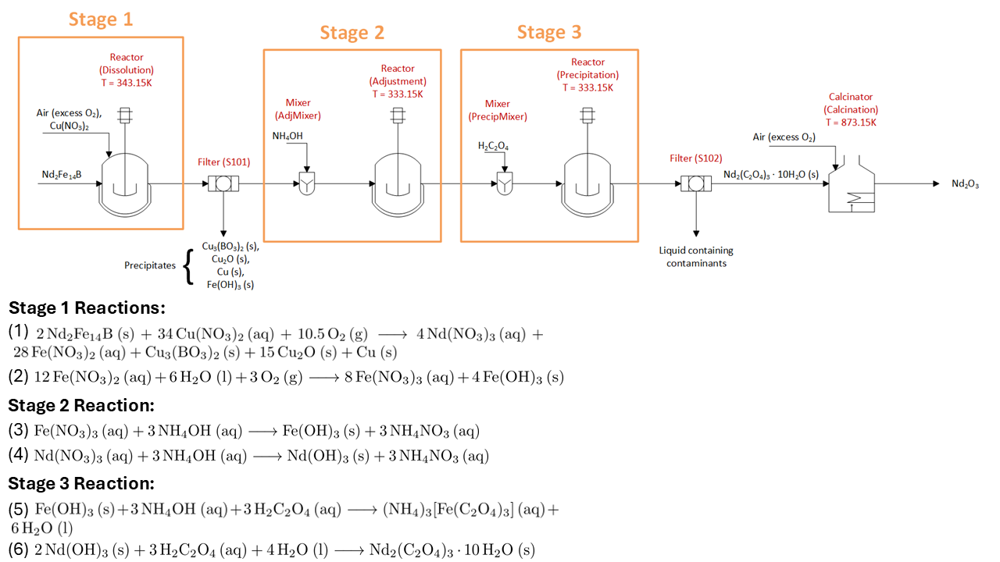

Critical Materials Innovation Hub (CMI) Process Flowsheet
=========================================================

Introduction
------------
This flowsheet models a process for recovering rare earth elements (REEs) from end-of-life (EOL) rare earth permanent magnets (REPM). 
This process utilizes a series of dissolution and precipitation reactions to recover the rare earth elements as rare earth oxalates [1].
The rare earth oxalates are then fired in a process called calcination to produce the final rare earth oxide (REO) product. In this
flowsheet, it was assumed that neodymium would be the only REE present, although dysprosium and praseodymium can be present in REPM as well [2].

Implementation
--------------
Figure 1 shows the process flow diagram for the CMI Process and the relevant reactions. In the first stage, the incoming REPM is dissolved in a solution of copper nitrate salt. 
This leads to the formation of precipitates containing the unwanted species: iron, boron, and copper. These unwanted species are then filtered from solution. 
Next, ammonium hydroxide is added to increase the pH of the solution, leading to the formation of rare earth hydroxides and the conversion of the remaining iron in solution
into iron hydroxide. In stage 3, oxalic acid is added to the solution leading to the formation of soluble iron-ammonium oxalate and insoluble rare earth oxalate. 
Finally, the rare earth oxalate is filtered from solution and calcined to produce the REO product. 

    Figure 1. CMI Process flowsheet

References
----------
[1] N.A. Chowdhury, S. Deng, H. Jin, D. Prodius, J.W. Sutherland, I.C Nlebedim, 
"Sustainable Recycling of Rare-Earth Elements from NdFeB Magnet Swarf: Techno-Economic and Environmental Perspectives", 
ACS Sustainable Chemistry & Engineering 2021 9(47), 15915-15924, DOI: 10.1021/acssuschemeng.1c05965.

[2] D. Gielen, M. Lyons, "Critical materials for the energy transition: Rare earth elements", International Renewable Energy Agency, Abu Dhabi.