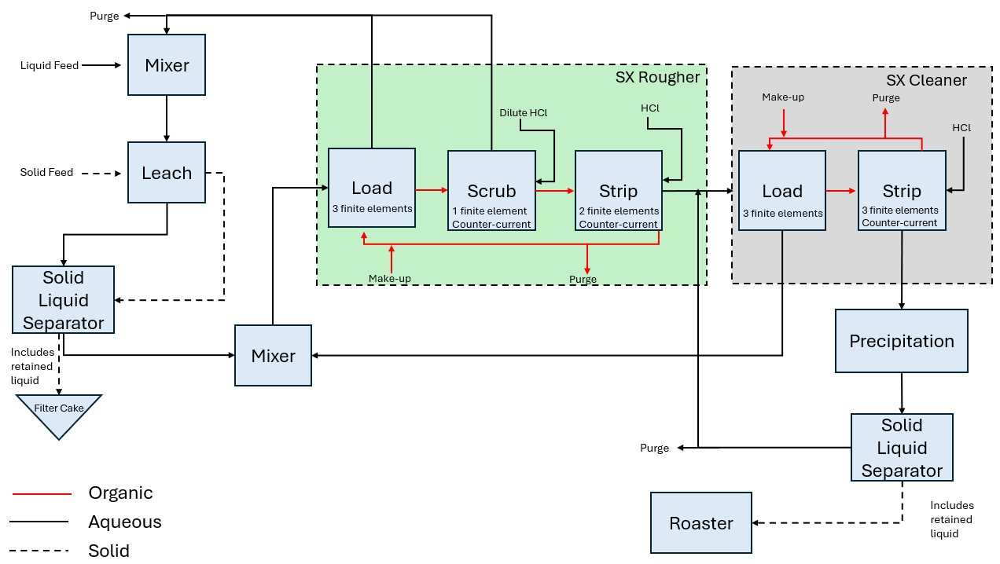

University of Kentucky REE Processing Plant
===========================================

Introduction
------------
The University of Kentucky (UKy) rare earth element (REE) processing plant is designed to extract salable rare earth oxides
from domestic U.S. coal and coal byproducts. While this implementation of the plant does not take into account
all of the complexities and unit processes detailed in the project report:math:`^1`, it details the major phenomena
by utilizing a series of conventional REE extraction techniques,
including acid tank leaching, solvent extraction, precipitation, and product roasting.

Implementation
--------------

Figure 1 shows the process flow diagram for the simplified, steady-state UKy plant where the solid and liquid feeds are
sent to a leaching tank for initial processing; then the solids (with some retained liquid) are separated out as a filter
cake while the remaining liquid is sent to the solvent extraction process which is comprised of 2 distinct circuits.
In the rougher circuit, solutes in the aqueous phase are transferred to the organic phase, and a portion of the
depleted aqueous solution is recycled back to the leaching process while the remainder is sent to the cleaner circuit.
The degree to which components are transferred from one phase to the other is dependent upon the unit's partition coefficient for that particular component.
In the cleaner circuit, solutes in the organic phase are transferred to the aqueous phase, and a portion of the loaded
aqueous solution is recycled back to the rougher circuit while the remainder is sent to the precipitator. The precipitate
(with some retained liquid) is sent to the roaster where the product rare earth oxides are generated, and the liquid from
the precipitator is recycled back to the cleaner circuit.

    Figure 1. University of Kentucky flowsheet

Documentation for each of the unit models can be found here:
    * Leaching
    * Solvent extraction
    * Precipitation
    * Product roaster

Degrees of Freedom
------------------
The following variables must be specified by the user to run the UKy flowsheet:
    * liquid feed volumetric flow rate and component concentrations
    * solid feed mass flow and component mass fractions
    * volume of leach tank(s)
    * partition coefficients for each solvent extraction unit
    * flow rate and component concentrations for organic make-up streams and acid feeds
    * split fractions for each recycle loop

Flowsheet Specifications
------------------------

.. csv-table::
   :header: "Description", "Value", "Units"

   "**Feed Water**"
   "Volumetric flow","20648", ":math:`\text{m}^3\text{/day}`"
   "Temperature", "308.15", ":math:`\text{K}`"
   "Pressure", "1", ":math:`\text{atm}`"
   "Soluble inert organic matter (S_I) concentration", "27", ":math:`\text{g/}\text{m}^3`"
   "Readily biodegradable substrate (S_S) concentration", "58", ":math:`\text{g/}\text{m}^3`"
   "Particulate inert organic matter (X_I) concentration", "92", ":math:`\text{g/}\text{m}^3`"
   "Slowly biodegradable substrate (X_S) concentration", "363", ":math:`\text{g/}\text{m}^3`"
   "Active heterotrophic biomass (X_B,H) concentration", "50", ":math:`\text{g/}\text{m}^3`"
   "Active autotrophic biomass (X_B,A) concentration", "0", ":math:`\text{g/}\text{m}^3`"
   "Particulate products arising from biomass decay (X_P) concentration", "0", ":math:`\text{g/}\text{m}^3`"
   "Oxygen (S_O) concentration", "0", ":math:`\text{g/}\text{m}^3`"
   "Nitrate and nitrite nitrogen (S_NO) concentration", "0", ":math:`\text{g/}\text{m}^3`"
   "NH4 :math:`^{+}` + NH :math:`_{3}` Nitrogen (S_NH) concentration", "23", ":math:`\text{g/}\text{m}^3`"
   "Soluble biodegradable organic nitrogen (S_ND) concentration", "5", ":math:`\text{g/}\text{m}^3`"
   "Particulate biodegradable organic nitrogen (X_ND) concentration", "16", ":math:`\text{g/}\text{m}^3`"
   "Alkalinity (S_ALK)", "7", ":math:`\text{mol/}\text{m}^3`"

   "**Activated Sludge Process**"
   "Reactor 1 volume", "1000", ":math:`\text{m}^3`"
   "Reactor 2 volume", "1000", ":math:`\text{m}^3`"
   "Reactor 3 volume", "1333", ":math:`\text{m}^3`"
   "Reactor 4 volume", "1333", ":math:`\text{m}^3`"
   "Reactor 5 volume", "1333", ":math:`\text{m}^3`"
   "Reactor 3 injection rate for component j", "0", ":math:`\text{g/}\text{s}`"
   "Reactor 4 injection rate for component j", "0", ":math:`\text{g/}\text{s}`"
   "Reactor 5 injection rate for component j", "0", ":math:`\text{g/}\text{s}`"
   "Reactor 3 outlet oxygen (S_O) concentration", "0.00172", ":math:`\text{g/}\text{m}^3`"
   "Reactor 4 outlet oxygen (S_O) concentration", "0.00243", ":math:`\text{g/}\text{m}^3`"
   "Reactor 5 outlet oxygen (S_O) concentration", "0.00449", ":math:`\text{g/}\text{m}^3`"
   "Reactor 5 underflow split fraction", "0.6", ":math:`\text{dimensionless}`"
   "Reactor 3 oxygen mass transfer coefficient", "7.6", ":math:`\text{hr}^{-1}`"
   "Reactor 4 oxygen mass transfer coefficient", "5.7", ":math:`\text{hr}^{-1}`"
   "Secondary clarifier H2O split fraction", "0.48956", ":math:`\text{dimensionless}`"
   "Secondary clarifier S_I split fraction", "0.48956", ":math:`\text{dimensionless}`"
   "Secondary clarifier S_S split fraction", "0.48956", ":math:`\text{dimensionless}`"
   "Secondary clarifier X_I split fraction", "0.00187", ":math:`\text{dimensionless}`"
   "Secondary clarifier X_S split fraction", "0.00187", ":math:`\text{dimensionless}`"
   "Secondary clarifier X_BH split fraction", "0.00187", ":math:`\text{dimensionless}`"
   "Secondary clarifier X_BA split fraction", "0.00187", ":math:`\text{dimensionless}`"
   "Secondary clarifier X_P split fraction", "0.00187", ":math:`\text{dimensionless}`"
   "Secondary clarifier S_O split fraction", "0.48956", ":math:`\text{dimensionless}`"
   "Secondary clarifier S_NO split fraction", "0.48956", ":math:`\text{dimensionless}`"
   "Secondary clarifier S_NH split fraction", "0.48956", ":math:`\text{dimensionless}`"
   "Secondary clarifier S_ND split fraction", "0.48956", ":math:`\text{dimensionless}`"
   "Secondary clarifier X_ND split fraction", "0.00187", ":math:`\text{dimensionless}`"
   "Secondary clarifier S_ALK split fraction", "0.48956", ":math:`\text{dimensionless}`"
   "Secondary clarifier surface area", "1500", ":math:`\text{m}^2`"
   "Separator recycle split fraction", "0.985", ":math:`\text{dimensionless}`"
   "Recycle pump outlet pressure", "101325", ":math:`\text{Pa}`"

   "**Primary Clarifier**"
   "Primary clarifier H2O split fraction", "0.993", ":math:`\text{dimensionless}`"
   "Primary clarifier S_I split fraction", "0.993", ":math:`\text{dimensionless}`"
   "Primary clarifier S_S split fraction", "0.993", ":math:`\text{dimensionless}`"
   "Primary clarifier X_I split fraction", "0.5192", ":math:`\text{dimensionless}`"
   "Primary clarifier X_S split fraction", "0.5192", ":math:`\text{dimensionless}`"
   "Primary clarifier X_BH split fraction", "0.5192", ":math:`\text{dimensionless}`"
   "Primary clarifier X_BA split fraction", "0.5192", ":math:`\text{dimensionless}`"
   "Primary clarifier X_P split fraction", "0.5192", ":math:`\text{dimensionless}`"
   "Primary clarifier S_O split fraction", "0.993", ":math:`\text{dimensionless}`"
   "Primary clarifier S_NO split fraction", "0.993", ":math:`\text{dimensionless}`"
   "Primary clarifier S_NH split fraction", "0.993", ":math:`\text{dimensionless}`"
   "Primary clarifier S_ND split fraction", "0.993", ":math:`\text{dimensionless}`"
   "Primary clarifier X_ND split fraction", "0.5192", ":math:`\text{dimensionless}`"
   "Primary clarifier S_ALK split fraction", "0.993", ":math:`\text{dimensionless}`"

   "**Anaerobic Digester**"
   "Anaerobic digester liquid volume", "3400", ":math:`\text{m}^3`"
   "Anaerobic digester vapor volume", "300", ":math:`\text{m}^3`"
   "Anaerobic digester liquid outlet temperature", "308.15", ":math:`\text{m}^3`"

   "**Dewatering Unit**"
   "Dewatering unit hydraulic retention time", "1800", ":math:`\text{s}`"
   "Dewatering unit specific energy consumption", "0.069", ":math:`\text{kWh/}\text{m}^3`"

   "**Thickener**"
   "Thickener hydraulic retention time", "86400", ":math:`\text{s}`"
   "Thickener diameter", "10", ":math:`\text{kWh/}\text{m}`"

Additional Variables
--------------------

.. csv-table::
   :header: "Description", "Symbol", "Value", "Units"

   "Maximum total suspended solids concentration", ":math:`TSS_{max}`", "0.03", ":math:`\text{kg/}\text{m}^3`"
   "Maximum chemical oxygen demand", ":math:`COD_{max}`", "0.1", ":math:`\text{kg/}\text{m}^3`"
   "Maximum total nitrogen concentration", ":math:`N_{max}`", "0.018", ":math:`\text{kg/}\text{m}^3`"
   "Maximum 5-day biological oxygen demand", ":math:`BOD5_{max}`", "0.01", ":math:`\text{kg/}\text{m}^3`"

Additional Constraints
----------------------
The subscript "out" represents the effluent from the secondary clarifier

.. csv-table::
   :header: "Description", "Equation"

   "Total suspended solids concentration", ":math:`TSS_{out} <= TSS_{max}`"
   "Chemical oxygen demand", ":math:`COD_{out} <= COD_{max}`"
   "Total nitrogen concentration", ":math:`N_{out} <= N_{max}`"
   "5-day biological oxygen demand", ":math:`BOD5_{out} <= BOD5_{max}`"

Future Refinements
------------------

The following modifications to BSM2 are planned for development:
    * Improving costing relationships in terms of detail, completeness, and reasonable validity
    * Accounting for temperature-dependence in the oxygen mass transfer coefficient (KLa) and oxygen concentration at saturation
    * Adding thermal energy requirements to the anaerobic digester and refining energy consumption estimates for units collectively
    * Replacing the ideal-separator formulation in the secondary clarifier with the widely used double-exponential settling model (i.e., the Takacs model)

References
----------
[1] Steven Keim, "Production of salable rare earths products from coal and coal byproducts in the U.S.
using advanced separation processes", 2019
