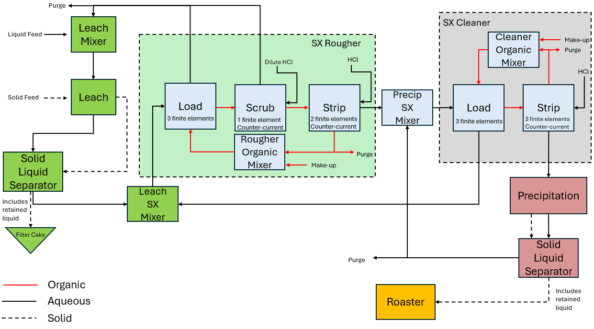

University of Kentucky REE Processing Plant
===========================================

Introduction
------------
The University of Kentucky (UKy) rare earth element (REE) processing plant is designed to extract salable rare earth oxides
from domestic U.S. coal and coal byproducts. While this implementation of the plant does not take into account
all of the complexities and unit processes detailed in the project report :math:`^1`, it details the major phenomena
by utilizing a series of conventional REE extraction techniques,
including acid tank leaching, solvent extraction, precipitation, and product roasting.

Implementation
--------------

Figure 1 shows the process flow diagram for the simplified, steady-state UKy plant where the solid and liquid feeds are
sent to a leaching tank for initial processing; then the solids (with some retained liquid) are separated out as a filter
cake while the remaining liquid is sent to the solvent extraction process which is comprised of 2 distinct circuits.
In the rougher circuit, solutes in the aqueous phase are transferred to the organic phase, and a portion of the
depleted aqueous solution is recycled back to the leaching process while the remainder is sent to the cleaner circuit.
The degree to which components are transferred from one phase to the other is dependent upon the unit's partition coefficient for that particular component.
In the cleaner circuit, solutes in the organic phase are transferred to the aqueous phase, and a portion of the loaded
aqueous solution is recycled back to the rougher circuit while the remainder is sent to the precipitator. The precipitate
(with some retained liquid) is sent to the roaster where the product rare earth oxides are generated, and the liquid from
the precipitator is recycled back to the cleaner circuit.

    University of Kentucky flowsheet

Documentation for each of the unit models can be found here:
    * Leaching
    * Solvent extraction
    * Precipitation
    * Product roaster

Degrees of Freedom
------------------
The following variables must be specified by the user to run the UKy flowsheet:
    * liquid feed volumetric flow rate and component concentrations
    * solid feed mass flow and component mass fractions
    * volume of leach tank(s)
    * partition coefficients for each solvent extraction unit
    * flow rate and component concentrations for organic make-up streams and HCl feeds
    * liquid recovery fraction for solid-liquid separators
    * precipitator inlet temperature
    * roaster inlet temperature and pressure, pressure drop, molar flow, and component mole fractions
    * split fractions for each recycle loop

Flowsheet Specifications
------------------------

.. csv-table::
   :header: "Description", "Value", "Units"

   "**Leaching**"
   "Tank volume", "100", ":math:`\text{m}^3`"
   "Liquid feed volumetric flow","224.3", ":math:`\text{L/hr}`"
   "Liquid feed H concentration", "100", ":math:`\text{mg/L}`"
   "Liquid feed HSO4 concentration", "1e-8", ":math:`\text{mg/L}`"
   "Liquid feed SO4 concentration", "4800", ":math:`\text{mg/L}`"
   "Liquid feed REE and contaminant concentrations", "1e-10", ":math:`\text{mg/L}`"
   "Solid feed mass flow","22.68", ":math:`\text{kg/hr}`"
   "Solid feed inerts mass fraction","0.6952", ":math:`\text{dimensionless}`"
   "Solid feed Al2O3 mass fraction","0.237", ":math:`\text{dimensionless}`"
   "Solid feed Fe2O3 mass fraction","0.0642", ":math:`\text{dimensionless}`"
   "Solid feed CaO mass fraction","0.00331", ":math:`\text{dimensionless}`"
   "Solid feed Sc2O3 mass fraction","2.8e-5", ":math:`\text{dimensionless}`"
   "Solid feed Y2O3 mass fraction","0.237", ":math:`\text{dimensionless}`"
   "Solid feed La2O3 mass fraction","0.237", ":math:`\text{dimensionless}`"
   "Solid feed Ce2O3 mass fraction","0.237", ":math:`\text{dimensionless}`"
   "Solid feed Pr2O3 mass fraction","0.237", ":math:`\text{dimensionless}`"
   "Solid feed Nd2O3 mass fraction","0.237", ":math:`\text{dimensionless}`"
   "Solid feed Sm2O3 mass fraction","0.237", ":math:`\text{dimensionless}`"
   "Solid feed Gd2O3 mass fraction","0.237", ":math:`\text{dimensionless}`"
   "Solid feed Dy2O3 mass fraction","0.237", ":math:`\text{dimensionless}`"

   "**Solvent Extraction Rougher**"
   "Loading section organic feed volumetric flow","62.01", ":math:`\text{L/hr}`"
   "Organic make-up REE and contaminant concentrations","1e-7", ":math:`\text{mg/L}`"
   "Scrubbing section acid feed volumetric flow","0.09", ":math:`\text{L/hr}`"
   "Scrubbing section acid feed H concentration","10.36", ":math:`\text{mg/L}`"
   "Scrubbing section acid feed Cl concentration","359.64", ":math:`\text{mg/L}`"
   "Scrubbing section acid feed REE and contaminant concentrations","1e-7", ":math:`\text{mg/L}`"
   "Stripping section acid feed volumetric flow","0.09", ":math:`\text{L/hr}`"
   "Stripping section acid feed H concentration","41.44", ":math:`\text{mg/L}`"
   "Stripping section acid feed Cl concentration","1438.56", ":math:`\text{mg/L}`"
   "Stripping section acid feed REE and contaminant concentrations","1e-7", ":math:`\text{mg/L}`"

   "**Solvent Extraction Cleaner**"
   "Loading section organic feed volumetric flow","62.01", ":math:`\text{L/hr}`"
   "Organic make-up REE and contaminant concentrations","1e-7", ":math:`\text{mg/L}`"
   "Stripping section acid feed volumetric flow","0.09", ":math:`\text{L/hr}`"
   "Stripping section acid feed H concentration","41.44", ":math:`\text{mg/L}`"
   "Stripping section acid feed Cl concentration","1438.56", ":math:`\text{mg/L}`"
   "Stripping section acid feed REE and contaminant concentrations","1e-7", ":math:`\text{mg/L}`"

   "**Precipitator**"
   "Inlet temperature","348.15", ":math:`\text{K}`"

   "**Roaster**"
   "Pressure drop","0", ":math:`\text{Pa}`"
   "Gas inlet temperature","348.15", ":math:`\text{K}`"
   "Gas outlet temperature","873.15", ":math:`\text{K}`"
   "Gas inlet pressure","101325", ":math:`\text{Pa}`"
   "Gas inlet molar flow","0.00781", ":math:`\text{mol/s}`"
   "Gas inlet O2 mole fraction","0.1118", ":math:`\text{dimensionless}`"
   "Gas inlet H2O mole fraction","0.1005", ":math:`\text{dimensionless}`"
   "Gas inlet CO2 mole fraction","0.0431", ":math:`\text{dimensionless}`"
   "Gas inlet N2 mole fraction","0.7446", ":math:`\text{dimensionless}`"
   "Moisture inlet molar flow","6.75e-4", ":math:`\text{mol/s}`"
   "Oxide recovery fraction","0.95", ":math:`\text{dimensionless}`"

   "**Separators**"
   "Leaching solid-liquid separator liquid recovery fraction","0.7", ":math:`\text{dimensionless}`"
   "Solvent extraction rougher load recycle split fraction","0.9", ":math:`\text{dimensionless}`"
   "Solvent extraction rougher scrub recycle split fraction","0.9", ":math:`\text{dimensionless}`"
   "Solvent extraction rougher organic recycle split fraction","0.9", ":math:`\text{dimensionless}`"
   "Solvent extraction cleaner organic recycle split fraction","0.9", ":math:`\text{dimensionless}`"
   "Precipitator solid-liquid separator liquid recovery fraction","0.7", ":math:`\text{dimensionless}`"
   "Precipitator solid-liquid separator liquid recycle split fraction","0.9", ":math:`\text{dimensionless}`"

Costing
-------
Unit model costing in this flowsheet is preliminary and is based on the commercial scale unit model parameters provided in Table 4-28 :math:`^1`.
However, this flowsheet is at the pilot scale, so while some of the unit model costing parameters have been scaled down
accordingly, a more robust scale-down procedure of the costing parameters is necessary to accurately approximate the cost of this pilot scale system.

References
----------
[1] Steven Keim, "Production of salable rare earths products from coal and coal byproducts in the U.S.
using advanced separation processes", 2019
