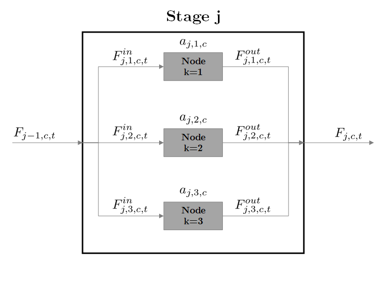

=====================================
Superstructure Function Documentation
=====================================

:Author: Christopher Laliwala
:Date:   October 2025

.. contents::
   :depth: 3

Overview
========

This function employs superstructure optimization to identify optimal
processing pathways for recovering materials from end-of-life products.
The framework assumes discrete operations for first-stage disassembly
and continuous operations for subsequent processing stages. Applications
are demonstrated in [EVLaliwala2024]_ and [HDDLaliwala2024]_. Users can
optionally consider byproduct valorization and environmental impacts in
their pathway selection.

Building Superstructure Model
=============================

The :func:`build_model` function constructs a Pyomo superstructure optimization model that identifies 
optimal processing pathways for recovering materials from end-of-life products. The function performs 
validation on all inputs, builds the mathematical model with appropriate variables and constraints, 
and returns a :class:`ConcreteModel` ready for optimization.

Function Arguments
------------------

The arguments that must be passed to build the superstructure model are shown below:

.. list-table:: Arguments for the build_model function
   :name: Table:build_model_args
   :widths: 30 15 55
   :header-rows: 1

   * - **Argument**
     - **Type**
     - **Description**
   
   * - **Objective Function**
     -
     -
   
   * - ``obj_func``
     - ObjectiveFunctionChoice
     - Choice of objective function. Options are ``ObjectiveFunctionChoice.NET_PRESENT_VALUE`` or ``ObjectiveFunctionChoice.COST_OF_RECOVERY``.
   
   * - **Plant Lifetime Parameters**
     -
     -
   
   * - ``plant_start``
     - int
     - The year that plant construction begins.
   
   * - ``plant_lifetime``
     - int
     - The total lifetime of the plant, including plant construction. Must be at least three years.
   
   * - **Feed Parameters**
     -
     -
   
   * - ``available_feed``
     - dict
     - Total feedstock available (number of EOL products) for recycling each year.
   
   * - ``collection_rate``
     - float
     - Collection rate for how much available feed is processed by the plant each year.
   
   * - ``tracked_comps``
     - list
     - List of tracked components.
   
   * - ``prod_comp_mass``
     - dict
     - Mass of tracked components per EOL product (kg / EOL product).
   
   * - **Superstructure Formulation Parameters**
     -
     -
   
   * - ``num_stages``
     - int
     - Number of total stages.
   
   * - ``options_in_stage``
     - dict
     - Number of options in each stage.
   
   * - ``option_outlets``
     - dict
     - Set of options k' in stage j+1 connected to option k in stage j.
   
   * - ``option_efficiencies``
     - dict
     - Tracked component retention efficiency for each option.
   
   * - **Operating Parameters**
     -
     -
   
   * - ``profit``
     - dict
     - Profit per unit of product in terms of tracked components ($/kg tracked component).
   
   * - ``opt_var_oc_params``
     - dict
     - Variable operating cost parameters for options that are continuous. Variable operating costs assumed to be proportional to the feed entering the option.
   
   * - ``operators_per_discrete_unit``
     - dict
     - Number of operators needed per discrete unit for options that utilize discrete units.
   
   * - ``yearly_cost_per_unit``
     - dict
     - Yearly operating costs per unit ($/year) for options which utilize discrete units.
   
   * - ``capital_cost_per_unit``
     - dict
     - Cost per unit ($) for options which utilize discrete units.
   
   * - ``processing_rate``
     - dict
     - Processing rate per unit for options that utilize discrete units. In terms of end-of-life products disassembled per year per unit (number of EOL products / year).
   
   * - ``num_operators``
     - dict
     - Number of operators needed for each continuous option.
   
   * - ``labor_rate``
     - float
     - Yearly wage per operator ($ / year).
   
   * - **Discretized Costing Parameters**
     -
     -
   
   * - ``discretized_purchased_equipment_cost``
     - dict
     - Discretized cost by flows entering for each continuous option ($/kg).
   
   * - **Environmental Impacts Parameters**
     -
     -
   
   * - ``consider_environmental_impacts``
     - bool
     - Choice of whether or not to consider environmental impacts.
   
   * - ``options_environmental_impacts``
     - dict
     - Environmental impacts matrix. Unit chosen indicator per unit of incoming flowrate.
   
   * - ``epsilon``
     - float
     - Epsilon factor for generating the Pareto front.
   
   * - **Byproduct Valorization Parameters**
     -
     -
   
   * - ``consider_byproduct_valorization``
     - bool
     - Decide whether or not to consider the valorization of byproducts.
   
   * - ``byproduct_values``
     - dict
     - Byproducts considered, and their value ($/kg).
   
   * - ``byproduct_opt_conversions``
     - dict
     - Conversion factors for each byproduct for each option.

If NPV maximization is chosen, a mixed-integer linear programming model is constructed (MILP),
if COR minimization is chosen, a mixed-integer quadratically constrained programming model is constructed (MIQCP).
It is recommended that the user install Gurobi, as this solver can deal with both formulations, and
also can deal with the SOS2 constraints that are generated for the piecewise-linear constraints.

Default Costing Parameters
===========================

The following table shows the default costing parameters used in the superstructure model. 
These values are based on NETL's Quality Guidelines for Energy System Studies (QGESS) [Theis2021]_ 
and economic assumptions from Keim et al. (2019) [Keim2019]_. All parameters are mutable and 
can be modified by the user after model creation.

.. list-table:: Default Costing Parameters
   :name: Table:default_costing_params
   :widths: 35 45 20
   :header-rows: 1

   * - **Parameter**
     - **Description**
     - **Default Value**
   
   * - ``lang_factor``
     - Lang factor for calculating total plant cost from equipment costs.
     - 2.97
   
   * - ``i_operating_expense_escalation``
     - Operating expenses escalation rate.
     - 0.03 (3%)
   
   * - ``i_capital_escalation``
     - Capital expenses escalation rate.
     - 0.036 (3.6%)
   
   * - ``discount_factor``
     - Discount factor for calculating the net present value. The after-tax weighted average cost of capital (ATWACC) is used.
     - 0.0577 (5.77%)
   
   * - ``financing_factor``
     - Factor for calculating financing costs from total plant cost.
     - 0.027 (2.7%)
   
   * - ``other_costs_factor``
     - Factor for calculating 'other costs' as defined by QGESS from the total plant cost.
     - 0.15 (15%)
   
   * - ``m_and_sm_costing_factor``
     - Factor for calculating Maintenance & Supply Materials as a percentage of total plant cost.
     - 0.02 (2%)
   
   * - ``sa_and_qa_qc_costing_factor``
     - Factor for calculating Sample Analysis & Quality Assurance/Quality Control as a percentage of cost of labor.
     - 0.1 (10%)
   
   * - ``s_ip_r_and_d_costing_factor``
     - Factor for calculating Sales, Intellectual Property, and Research & Development as a percentage of total profit.
     - 0.01 (1%)
   
   * - ``a_and_sl_costing_factor``
     - Factor for calculating Administrative & Supporting Labor as a percentage of cost of labor.
     - 0.2 (20%)
   
   * - ``fb_costing_factor``
     - Factor for calculating Fringe Benefits as a percentage of cost of labor.
     - 0.25 (25%)
   
   * - ``pt_and_i_costing_factor``
     - Factor for calculating Property Taxes & Insurance as a percentage of total plant cost.
     - 0.01 (1%)
   
   * - ``total_overnight_capital_fraction_expended``
     - Fraction of total overnight capital expended in each year. 10% in year 1, 60% in year 2, and 30% in year 3.
     - Year 1: 0.1, Year 2: 0.6, Year 3: 0.3
   
   * - ``plant_overhead_factor``
     - Factor for calculating plant overhead as a percentage of total operating costs each year.
     - 0.2 (20%)

Viewing Results
===============

After building and solving the superstructure model, results can be reported to the console 
using the reporting functions in the :mod:`prommis.superstructure.report_superstructure_results` 
module. These functions provide detailed information about the optimal pathway selected, 
economic metrics, and environmental impacts.

The following reporting functions are available:

- **report_optimal_pathway**: Displays the selected processing options for each stage
- **report_economics**: Shows NPV, CAPEX, OPEX, and revenue breakdown
- **report_material_flows**: Reports component flows through the superstructure
- **report_superstructure_environmental_impacts**: Reports yearly and total environmental impacts generated by the process

Example usage::

    from prommis.superstructure.report_superstructure_results import report_optimal_pathway
    
    # After solving the model
    report_optimal_pathway(model, results)

For detailed documentation of all reporting functions, see the 
Class Documentation section below.

Model Formulation
=================

Mass Balance Equations
----------------------

The superstructure is modeled as a network where the arrows represent
flows and the boxes, or 'nodes', represent potential processing options
(technologies). As depicted, these technologies are organized in stages.

   Generic Mass Balance Diagram

:numref:`fig:Gen_MB_Bal` illustrates the mass balances for a
generic stage :math:`j`. In this diagram, :math:`F_{j-1,c,t}` is the
upstream flow of component :math:`c` coming from the previous stage
:math:`j-1` in year :math:`t`. :math:`F^{in}_{j,k,c,t}` represents the
inlet stream of component :math:`c` entering node :math:`k` in stage
:math:`j` at time :math:`t`. The sum of the inlet streams
:math:`F^{in}_{j,k,c,t}` is equal to the upstream flow,
:math:`F_{j-1,c,t}`, as depicted in :eq:`eqn:MB1`:

.. math::
   :label: eqn:MB1

   F_{j-1,c,t} = \sum_{k \in K(j)} F^{in}_{j,k,c,t} \qquad \forall  j \in J \setminus {j=1}, c \in C, t \in T

However, for the first stage, :math:`j=1`, the number of EOL products
the plant processes in year :math:`t` is represented by
:math:`P^{entering}_{prod,t}`. Thus, the sum of the inlet streams
:math:`F^{in}_{j,k,c,t}` in the initial stage is equal to the flow of
EOL product entering the plant. This is depicted in :eq:`eqn:MB2`:

.. math::
   :label: eqn:MB2

   P^{entering}_{prod,t} \cdot X_{prod,c,t} = \sum_{k \in K(j)} F^{in}_{j,k,c,t} \qquad   j = 1, \quad \forall c \in C, t \in T

where :math:`X_{prod,c,t}` is the amount of component :math:`c` per EOL
product in year :math:`t`.

Referring back to :numref:`fig:Gen_MB_Bal`,
:math:`F^{out}_{j,k,c,t}` is the outlet stream of component :math:`c`
exiting node :math:`k` in stage :math:`j` at time :math:`t` and is
related to the inlet :math:`F^{in}_{j,k,c,t}` by the efficiency
parameter :math:`a_{j,k,c}`, as shown in :eq:`eqn:MB7`:

.. math::
   :label: eqn:MB7

   F^{in}_{j,k,c,t} \cdot a_{j,k,c} = F^{out}_{j,k,c,t} \qquad \forall j \in J, k \in K(j), c \in C, t \in T

where the efficiency parameter :math:`a_{j,k,c}` represents the
percentage of component :math:`c` that is retained in node :math:`k` in
stage :math:`j`, and thus varies from 0 to 1.

Finally, the variable :math:`F_{j,c,t}` represents the flow of component
:math:`c` exiting stage :math:`j` at time :math:`t`, and is the sum of
the outlet streams :math:`F^{out}_{j,k,c,t}`, as shown in :eq:`eqn:MB8`.

.. math::
   :label: eqn:MB8

   \sum_{k \in K(j)} F^{out}_{j,k,c,t} = F_{j,c,t}  \qquad \forall  j \in J \setminus {j=j_{final}}, c \in C, t \in T

Logical Constraints
-------------------

To ensure that only one optimal pathway is chosen, logical constraints
are formulated. We define the binary variables :math:`y_{j,k}` for each
node, which indicates whether node :math:`k` in stage :math:`j` is
selected. Only one node per stage may be chosen (:eq:`eqn:LC1`). It is worth noting here that all stages
include a blank node that allows the stage to be bypassed.

.. math::
   :label: eqn:LC1

   \sum_{k \in K(j)} y_{j,k} = 1 \qquad \forall j \in J

Additionally, not all nodes are connected. Therefore, if a node in stage
:math:`j \neq j_{final}` is selected, a connected node must be chosen in
the next stage. This is implemented in :eq:`eqn:LC2`,

.. math::
   :label: eqn:LC2

   \sum_{k' \in K(j,k)} y_{j+1,k'} \geq  y_{j,k} \qquad\forall j \in J \setminus {j=4}

where :math:`k'` is an alias for :math:`k`, and :math:`K(j,k)` is the
set of nodes in stage :math:`j+1` that are connected to the node
:math:`k` in stage :math:`j`.

Finally, Big-M constraints are formulated to ensure that nodes that are
not chosen have no flow through them (:eq:`eqn:BigM1` and :eq:`eqn:BigM2`).

.. math::
   :label: eqn:BigM1

   0 \leq F^{in}_{j,k,c,t} \leq y_{j,k} \cdot M_{j,k,c,t} \qquad \forall j \in J, k \in K(j), c \in C, t \in T

.. math::
   :label: eqn:BigM2

   0 \leq F^{out}_{j,k,c,t} \leq y_{j,k} \cdot M_{j,k,c,t} \qquad \forall j \in J, k \in K(j), c \in C, t \in T

Where :math:`M_{j,k,c,t}` and :math:`M^{out}_{j,k,c,t}` represent the
upper bound of the flowrate.

Cost Equations
--------------

Capital Expenses
~~~~~~~~~~~~~~~~

For the capital expenses, the methodology presented in NETL's Quality
Guidelines for Energy System Studies
(QGESS) [Theis2021]_ is followed. However, since the
methodology was developed for power plants, modifications to match the
economic assumptions in Keim et al. (2019) [Keim2019]_ 
are made. It is important to note that all costing parameters (i.e. Lang
Factor, financing, etc.) are all mutable parameters that can be changed
by the user from their default values. Others, such as the product price
:math:`Price_c`, must be provided by the user.

The capital cost levels from QGESS up until the Total Overnight Cost
(:math:`TOC`) are shown in :numref:`Table:QGESS_cost_levels`. To
calculate the :math:`TOC`, the total cost of purchased equipment is
first calculated for each process node in the superstructure. Piecewise
linear approximations are used for scaling equipment costs as functions
of equipment size for all stages except disassembly, where discrete
values are required. Next, the Total Plant Cost (:math:`TPC`) is
calculated by multiplying the updated total cost of purchased equipment
by a Lang Factor (:math:`LF`) [Keim2019]_ for each
process node in all stages besides the disassembly stages and then
summing them. For nodes in the disassembly stage, no Lang Factor is
used. Thus, the TPC is computed as:

.. math::
   :label: eqn:TPC

   TPC = LF \cdot \sum_{j \in J \setminus j=1} \sum_{k \in K(j)} C_{P,j,k} + \sum_{k \in K(j=1)} C_{P,j=1,k}

where :math:`C_{P,j,k}` is the total cost of purchased equipment for
node :math:`k` in stage :math:`j`.

The :math:`TOC` is calculated by :eq:`eqn:TOC`:

.. math::
   :label: eqn:TOC

   TOC = TPC + financing + other \: costs

where :math:`financing` and :math:`other \: costs` are 2.7% and 15% of
the TPC, respectively [Theis2021]_.

.. table:: QGESS capital cost levels: Bare Erected Cost (BEC),
   Engineering, Procurement, and Construction Cost (EPCC), Total Plant
   Cost (TPC), and the Total Overnight Capital (TOC) [Theis2021]_.
   :name: Table:QGESS_cost_levels

   +------------------------+--------------------------------------------+
   | **Capital Cost Level** | **Includes:**                              |
   +========================+============================================+
   | BEC                    | Process equipment, Supporting facilities,  |
   |                        | Direct and indirect labor                  |
   +------------------------+--------------------------------------------+
   | EPCC                   | BEC and EPC contractor services            |
   +------------------------+--------------------------------------------+
   | TPC                    | EPCC and Process contingency and Project   |
   |                        | contingency                                |
   +------------------------+--------------------------------------------+
   | TOC                    | TPC and Financing costs and Other owner's  |
   |                        | costs                                      |
   +------------------------+--------------------------------------------+

Operating Expenses (OPEX)
~~~~~~~~~~~~~~~~~~~~~~~~~

Both fixed and variable costs are considered for operating expenses. The
variable operating costs account for utilities, reagents, and waste
disposal and are assumed to be linearly related to the size of the
process:

.. math:: 
   
   OPEX^{Var}_{j,k,t} = A_{j,k} \cdot F^{in,total}_{j,k,t} + B_{j,k} \cdot y_{j,k}

where :math:`A_{j,k}` and :math:`B_{j,k}` are the linear parameters for
option :math:`k` in stage :math:`j`, and :math:`F^{in,total}_{j,k,t}` is
the total flow entering the option.

For fixed operating costs, the cost of labor, maintenance and supply
materials, quality assurance/quality control (QA/QC), sales, IP, R&D,
administration and supporting labor, and property taxes and insurance
were considered. To calculate the cost of labor (:math:`COL`), we adopt
the methodology described in Ulrich et al.
(2004) [Ulrich2004]_, which assigns a number of
operators to the different units. Other fixed costs are summarized in
:numref:`Table:OC_fixed`. :math:`R_t` is the revenue in year
:math:`t`.

.. table:: Summary of fixed costs other than the cost of labor
   considered [Keim2019]_.
   :name: Table:OC_fixed

   +--------------------------------------------+------------------------+
   | **Category**                               | **Value**              |
   +============================================+========================+
   | Maintenance and Supply Materials (M&SM)    | :math:`0.02 \cdot TPC` |
   +--------------------------------------------+------------------------+
   | Sample Analysis & QA/QC (SA&QA/QC)         | :math:`0.1 \cdot COL`  |
   +--------------------------------------------+------------------------+
   | Sales, IP, and R&D Costs (S,IP,R&D) in     | :math:`0.01 \cdot R_t` |
   | year :math:`t`                             |                        |
   +--------------------------------------------+------------------------+
   | Administrative & Supporting Labor (A&SL)   | :math:`0.2 \cdot COL`  |
   +--------------------------------------------+------------------------+
   | Fringe benefits (FB)                       | :math:`0.25 \cdot COL` |
   +--------------------------------------------+------------------------+
   | Property Taxes & Insurance (PT&I)          | :math:`0.01 \cdot TPC` |
   +--------------------------------------------+------------------------+

Cost of Labor
-------------

To calculate the cost of labor, the user must provide the yearly wage
per operator, and the number of operators needed for each option. It is
assumed that the plant operates for 8000 hours per
year [Seider2017]_. For the hourly wage per worker, we
refer the user to [BLS2024]_, and for estimating the
number of workers needed per option we refer them to
[Ulrich2004]_ (in this methodology, the number of
workers needed is independent of equipment sizing).

Since [Ulrich2004]_ methodology allows for fractions of
workers (since workers can be responsible for multiple parts of a
process), the following methodology is followed to calculate the total
number of workers needed as an integer. First, the number of workers
needed :math:`workers_{j,k}`, in fractional form for all stages besides
the disassembly stage can be calculated using:

.. math::
   :label: eq:workers1

   workers_{j,k} = W_{j,k} * y_{j,k} \qquad \forall j \in J \setminus j=1, k \in K(j)

For nodes in the disassembly stage, either workers are employed or
discrete units are utilized. Thus, the number of workers needed is
dependent on the number of workers employed/units utilized for
disassembly. The calculation for the number of workers needed, in
fractional form, for all nodes in the disassembly stage is shown in :eq:`eq:workers2`:

.. math::
   :label: eq:workers2

   workers_{j,k} = W^{dis}_{j,k} * \sum_{i=0}^{max \: dis_{j,k}} i * y^{dis \: units}_{j,k,i} \qquad \forall j = 1, k \in K(j=1)

Where :math:`W^{dis}_{j,k}` is the number of workers needed per
disassembly unit/employee. :math:`y^{dis \: units}_{j,k,i}` is a binary
variable representing how many workers :math:`i` are chosen for node
:math:`k` in the disassembly stage :math:`j_{dis}`, and
:math:`max \: dis_{j,k}` is a parameter representing the maximum number
of units/workers for node k in the disassembly stage :math:`j_{dis}`
that could be utilized/employed.

For the disassembly nodes that employ workers instead of machinery,
:math:`W_{j=1,k}` is equal to one, as the number of workers needed is
equal to the number employed for disassembly. To calculate the total
number of workers employed as a whole number, :eq:`eq:workers3` is utilized:

.. math::
   :label: eq:workers3

   \sum_{j \in J} \sum_{k \in K(j)} workers_{j,k} \leq \sum_{i=0}^{max \: workers} i * y^{workers}_i

Where :math:`y^{workers}_{i}` is a binary variable representing how many
total workers :math:`i` are employed in the plant, and
:math:`max \: workers` is a parameter representing the maximum number of
workers that can be employed.

To ensure only a single number of workers is employed, :eq:`eq:workers4` is formulated:

.. math::
   :label: eq:workers4

   \sum_{i=0}^{max \: workers} y^{workers}_i = 1

Finally, the cost of labor, :math:`COL`, is calculated using :eq:`eq:workers5`:

.. math::
   :label: eq:workers5

   COL = wage * \sum_{i=0}^{max \: workers} i * y^{workers}_{i}

Where :math:`wage` is the yearly wage per worker.

Revenues
~~~~~~~~

The revenue in a given year :math:`t` is calculated by multiplying the
flow of each product leaving the final stage by its corresponding price,
:math:`Price_c` as shown in :eq:`eqn:Revenue` [Keim2019]_.

.. math::
   :label: eqn:Revenue

   R_t = \sum_{k \in K(j=j_{final})} \sum_{c \in C} F^{out}_{j=j_{final},k,c,t} \cdot Price_{c} \qquad \forall t \in T

Objective Functions
-------------------

Two objectives are available for users: maximizing the net present value
(NPV), and minimizing the cost of recovery (COR), which estimates the
selling price at which the NPV is zero.

Net Present Value
~~~~~~~~~~~~~~~~~

The NPV is given by:

.. math::
   :label: eqn:NPV

   NPV = \sum_{t \in T} \frac{CF_t}{(1 + IR)^t}

Where :math:`CF_t` is the cash flow in year :math:`t`, and :math:`IR` is
the interest rate. The cash flow was calculated using the methodology
discussed in Seider et al. (2017) [Seider2017]_. We
modify the methodology to account for the assumptions for capital
expenditure (:math:`TOC^{exp}_t`), capital escalation
(:math:`i^{esc,CAPEX}`), and revenue and operating costs escalation
(:math:`i^{esc,sales,OPEX}`) [Keim2019]_. The modified
equation is shown in :eq:`eqn:CF`.

.. math::
   :label: eqn:CF

   CF_t = (R_t - OPEX_t) \cdot (1 +  i^{esc,sales,OPEX})^{t - t_{prod \: start}} - TOC^{exp}_t \cdot (1 + i^{esc,CAPEX})^{t - t_{start}} \qquad \forall t \in T

where :math:`t_{start}` is the year when the plant begins construction,
:math:`t_{prod \: start}` is the year when the plant begins production,
and :math:`R_t` and :math:`OPEX_t` are the revenue and operating
expenses in year :math:`t`, respectively. It was assumed that the
capital costs would be spread over the first three years, with the
expenditure being 10% in the first year, 60% in the second year, and 30%
in the third year [Keim2019]_.

The NPV maximization problem is a mixed-integer linear optimization
(MILP) problem.

Cost of Recovery
~~~~~~~~~~~~~~~~

The COR is defined as the price of the product ($/kg) required for the
NPV to break even. To introduce COR in the optimization problem, we
modify the revenue expression (:eq:`eqn:Revenue`),

.. math::
   :label: eqn:COR_Revenue

   R_t = COR \cdot \sum_{k \in K(j=5)} \sum_{c \in C} F^{out}_{j=5,k,c,t} \qquad \forall t \in T

convert the NPV equation in :eq:`eqn:NPV` into a
constraint, and set it to zero.

.. math::
   :label: eqn:NPV_con

   NPV = \sum_{t \in T} \frac{CF_t}{(1 + IR)^t} = 0

:eq:`eqn:COR_Revenue` is non-linear, making
the COR minimization a mixed-integer non-linear optimization (MINLP)
problem.

Disassembly Stage
-----------------

Since the disassembly stage utilizes discrete units, calculation of
CAPEX and OPEX is different. First, the number of units utilized, or
workers employed (depending on which option is chosen), is calculated
such that the flow of incoming EOL products entering the plant can be
disassembled without hold-up, as depicted in :eq:`eq:Disunits1`:

.. math::
   :label: eq:Disunits1

   P^{entering}_{prod,t} \leq Dis \: Rate_{j,k} * \sum_{k \in K} \sum_{i=0}^{i=max \: dis_{j,k}} i * y^{dis \: units}_{j,k,i} \qquad \forall j=1, k \in K(j=1), t \in T

Where :math:`Dis \: Rate_{j,k}` is a parameter representing the rate of
disassembly of the EOL product per unit/worker for node :math:`k` in the
disassembly stage :math:`j=1` and must be provided by the user,
:math:`y^{dis \: units}_{j,k,i}` is a binary variable representing how
many workers, :math:`i`, are chosen for node :math:`k` in the
disassembly stage :math:`j=1`, and :math:`max \: dis_{j,k}` is a
parameter representing the maximum number of units/workers for node
:math:`k` in the disassembly stage :math:`j=1` that could be
utilized/employed.

To ensure only a single number of units/workers are utilized/employed,
:eq:`eq:Disunits2` is formulated:

.. math::
   :label: eq:Disunits2

   \sum_{i=0}^{max \: dis_{j,k}} y^{dis \: units}_{j,k,i} = 1 \qquad \forall j = 1, k \in K(j=1)

Finally, to ensure no workers are utilized/employed if a disassembly
node is not chosen, :eq:`eq:Disunits3` is formulated:

.. math::
   :label: eq:Disunits3

   y_{j,k} \geq 1 - y^{dis \: units}_{j,k,i=0} \qquad j=1, k \in K(j=1)

CAPEX
~~~~~

For the nodes that employ workers, the CAPEX is zero. For the nodes that
utilize discrete units, :eq:`eq:Disunits4` is
formulated:

.. math::
   :label: eq:Disunits4

   C_{P,j,k} = CU_{j,k} * \sum_{i=0}^{max \: dis_{j,k}} y^{dis \: units}_{j,k,i} * i \qquad \forall j=1, k \in K(j=1)

Where :math:`CU_{j,k}` is a parameter representing the cost per unit for
node :math:`k` in the disassembly stage :math:`j=1`. The cost per unit
for the disassembly nodes utilizing equipment for disassembly must be
provided by the user.

Variable operating costs
~~~~~~~~~~~~~~~~~~~~~~~~

To calculate the variable operating costs, :math:`OC^{var}_{j,k}` for
all nodes in the disassembly stage, :eq:`eq:Disunits5` is utilized:

.. math::
   :label: eq:Disunits5

   OC^{var}_{j,k} = YCU_{j,k} * \sum_{i=0}^{max \: dis_{j,k}} y^{dis \: units}_{j,k,i} * i \qquad \forall j = 1, k \in K(j=1)

Where :math:`YCU_{j,k}` is the yearly cost per unit for node :math:`k`
in stage :math:`j`. These values must be provided by the user.

Consideration of Byproduct Valorization
=======================================

An additional capability of this function is for users to consider the
valorization of byproducts into the overall economics of the process. If
the user opts to include this, then a dict containing the byproducts
considered and their value ($/kg) must be passed, along with a dict
containing the conversion factors of the incoming total flowrate
entering for each byproduct produced by each option.

The total amount of each byproduct produced each year is calculated:

.. math:: 
   
   F_{b,t} = \sum_{opt \in b(opt)} F_{opt,t}^{in, total} \cdot \alpha_{opt,b} \quad \forall b \in BP, t \in T

where :math:`F_{b,t}` is the amount of byproduct :math:`b` produced in
year :math:`t`, :math:`F_{opt,t}^{in, total}` is the total flow entering
the option, :math:`\alpha_{opt,b}` is the conversion factor for
producing byproduct :math:`b` in option :math:`opt`, :math:`b(opt)` is
the set of options that produce byproduct :math:`b`, and :math:`BP` is
the set of all byproducts.

The yearly profit from byproducts is calculated:

.. math:: 
   
   Byprod. \: Profit_t = \sum_{b \in BP} F_{b,t} \cdot Value_{b} \quad t \in T

where :math:`Value_b` is the value of byproduct :math:`b` in $/kg.

When byproduct valorization is considered, the calculation of the
revenue is modified differently depending on which objective function is
chosen. If the NPV is chosen, the revenue is calculated as:

.. math:: 
   
   R_t = Byprod. \: Profit_t + \sum_{k \in K(j=j_{final})} \sum_{c \in C} F^{out}_{j=j_{final},k,c,t} \cdot Price_{c} \quad \forall t \in T

and if the COR is chosen as the objective the revenue is calculated as:

.. math::
   
   R_t = Byprod. \: Profit_t + COR \cdot \sum_{k \in K(j=5)} \sum_{c \in C} F^{out}_{j=5,k,c,t} \quad \forall t \in T

Consideration of Environmental Impacts
======================================

The user also has the ability to consider environmental impacts of the
potential processes. The choice of which environmental impacts is left
up to the user. Typically, midpoint indicators are utilized to quantify
environmental impacts. A common midpoint indicator tool for quantifying
environmental impacts is the EPA's Tool for the Reduction and Assessment
of Chemical and Other Environmental Impacts
(TRACI) [TRACI]_.

The total environmental impacts generated can be calculated by summing
the impacts generated by each option over the lifetime of the plant:

.. math:: 
   
   EI = \sum_{t \in T} \sum_{opt \in OPTS} \theta_{opt} \cdot F^{in,total}_{opt,t}

where :math:`EI` is the environmental impact chosen by the user,
:math:`OPTS` is the set of all options in the superstructure, and
:math:`\theta_{opt}` is a parameter for the amount of emissions
generated by option :math:`opt` per incoming feed entering and must be
provided by the user, and :math:`F^{in,total}_{opt,t}` is the flowrate
entering option :math:`opt` in year :math:`t`.

Consideration of environmental impacts leads to the formation of a
multi-criteria optimization problem. This function utilizes the
:math:`\epsilon`-constraint method. By calling the function for varying
values of :math:`\epsilon`, the user can construct the Pareto front.

Class Documentation
===================

ObjectiveFunctionChoice
-----------------------

.. autoclass:: prommis.superstructure.objective_function_enums.ObjectiveFunctionChoice
   :members:
   :undoc-members:
   :show-inheritance:

Superstructure Function
------------------------

.. automodule:: prommis.superstructure.superstructure_function
   :members:
   :undoc-members:
   :show-inheritance:

Report Superstructure Results
------------------------------

.. automodule:: prommis.superstructure.report_superstructure_results
   :members:
   :undoc-members:
   :show-inheritance:

References
==========

.. [EVLaliwala2024] Laliwala, Christopher and Ana Torres. "Recycling Rare Earth Elements from End-of-Life Electric and Hybrid Electric Vehicle Motors." *Computer Aided Chemical Engineering* 53 (2024): 1309-1314.

.. [HDDLaliwala2024] Laliwala, Chris and Ana I. Torres. "Design and Optimization of Processes for Recovering Rare Earth Elements from End-of-Life Hard Disk Drives." *Systems & Control Transactions* 3 (2024): 496-503.

.. [Keim2019] Keim, Steven A. "Production of Salable Rare Earths Products from Coal and Coal Byproducts in the U.S. Using Advanced Separation Processes: Phase 1." Technical report, Marshall Miller & Associates, Inc., 2019.

.. [Theis2021] Theis, Joel. "Cost Estimation Methodology for NETL Assessments of Power Plant Performance." Technical report, National Energy Technology Laboratory, 2021.

.. [Ulrich2004] Ulrich, Gael D. and Palligarnai T. Vasudevan. *Chemical Engineering Process Design and Economics: A Practical Guide*. Durham: Process Publishing, 2004.

.. [BLS2024] U.S. Bureau of Labor Statistics. "Occupational Employment and Wages, May 2023." 2024. https://www.bls.gov/oes/current/oes518091.htm. Accessed: 2024-09-16.

.. [TRACI] EPA. "Tool for Reduction and Assessment of Chemicals and Other Environmental Impacts (TRACI)." 2024. https://www.epa.gov/chemical-research/tool-reduction-and-assessment-chemicals-and-other-environmental-impacts-traci. Accessed: 2025-10-12.

.. [Seider2017] Seider, Warren D., Daniel R. Lewin, J.D. Seader, Soemantri Widagdo, Rafiqul Gani, and Ka Ming Ng. *Product and Process Design Principles*. Hoboken, NJ: Wiley, 2017.
