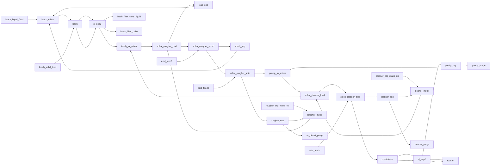

# Graph

```mermaid
flowchart LR 
   Unit_B[leach_mixer]
   Unit_C[leach]
   Unit_D[leach_liquid_feed]
   Unit_E[sl_sep1]
   Unit_F[leach_solid_feed]
   Unit_G[precipitator]
   Unit_H[sl_sep2]
   Unit_I[leach_sx_mixer]
   Unit_J[leach_filter_cake_liquid]
   Unit_K[leach_filter_cake]
   Unit_L[precip_sep]
   Unit_M[precip_purge]
   Unit_N[precip_sx_mixer]
   Unit_O[roaster]
   Unit_P[solex_cleaner_load]
   Unit_Q[solex_cleaner_strip]
   Unit_R[cleaner_mixer]
   Unit_S[cleaner_org_make_up]
   Unit_T[acid_feed3]
   Unit_U[cleaner_sep]
   Unit_V[cleaner_purge]
   Unit_W[solex_rougher_load]
   Unit_X[load_sep]
   Unit_Y[solex_rougher_scrub]
   Unit_Z[rougher_mixer]
   Unit_AA[rougher_org_make_up]
   Unit_AB[acid_feed1]
   Unit_AC[scrub_sep]
   Unit_AD[solex_rougher_strip]
   Unit_AE[acid_feed2]
   Unit_AF[rougher_sep]
   Unit_AG[sc_circuit_purge]
   Unit_B --> Unit_C
   Unit_D --> Unit_B
   Unit_C --> Unit_E
   Unit_F --> Unit_C
   Unit_C --> Unit_E
   Unit_G --> Unit_H
   Unit_G --> Unit_H
   Unit_E --> Unit_I
   Unit_E --> Unit_J
   Unit_E --> Unit_K
   Unit_L --> Unit_M
   Unit_L --> Unit_N
   Unit_H --> Unit_L
   Unit_H --> Unit_O
   Unit_H --> Unit_O
   Unit_N --> Unit_P
   Unit_P --> Unit_I
   Unit_P --> Unit_Q
   Unit_R --> Unit_P
   Unit_S --> Unit_R
   Unit_T --> Unit_Q
   Unit_Q --> Unit_G
   Unit_Q --> Unit_U
   Unit_U --> Unit_V
   Unit_U --> Unit_R
   Unit_I --> Unit_W
   Unit_W --> Unit_X
   Unit_X --> Unit_B
   Unit_W --> Unit_Y
   Unit_Z --> Unit_W
   Unit_AA --> Unit_Z
   Unit_AB --> Unit_Y
   Unit_Y --> Unit_AC
   Unit_AC --> Unit_B
   Unit_Y --> Unit_AD
   Unit_AE --> Unit_AD
   Unit_AD --> Unit_N
   Unit_AD --> Unit_AF
   Unit_AF --> Unit_AG
   Unit_AF --> Unit_Z

```
