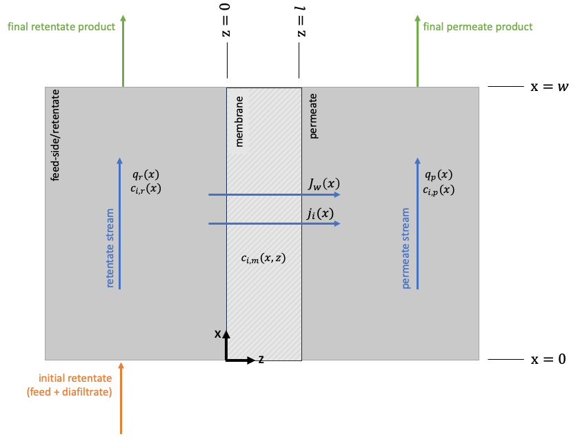

# Nanofiltration (NF)

## nf_brine.py
This is an example flowsheet for the separation of lithium and magnesium ions using nanofiltration (NF). The unit model is the Donnan Steric Pore Model with Dielectric Exclusion (DSPM-DE) and the property model is the Multi-Component Aqueous Solution (MCAS) property package, both of which can be found in WaterTAP. Currently, the inlet feed is modeling the Salar de Atacama brine. 

The objective of the Pyomo model is to limit the amount of lithium lost in the retentate stream, with 2 degrees of freedom (pressure, area). Operating at this extreme end of the tradeoff between the selectivity and permeability, combined with the low solvent flux for this example, the magnesium rejection is low (~14%). An additional constraint is enacted on the model to limit the feed pressure to 70 bar, per typical experimental capabilities.

Good references for details on the NF model, i.e., the DSPM-DE model: https://doi.org/10.1021/acs.est.2c08584 ; https://doi.org/10.1016/j.memsci.2020.118809

## nf_brine_plot.py
This file uses the nf_brine.py flowsheet to perform a sensitivity analysis on the volume recovery of the nanofiltration system. The file outputs four subplots:

1. Ion Rejection versus Volume Recovery: As the volume recovery (i.e., the relative amount of total solution recovered in the permeate) increases, the lithium rejection monotonically decreases and the magnesium rejection shows a local maxima. This is the result of the tradeoff between the permeability and selectivity of the membrane.

2. Mg:Li Ratio versus Volume Recovery: The ratio of Mg:Li in the feed is constant, which is represented by the red line. All results tested show that the permeate stream has smaller Mg:Li ratios than the feed, which is desirable as the end goal is purifying lithium. There is a local minima at a volume recovery of ~55%.

3. Membrane Area (m2) versus Volume Recovery: The membrane area increases as the system capacity (volume recovery) increases.

4. Feed Pressure (bar) versus Volume Recovery: The optimal feed pressure increases as the system capacity increases and the membrane area reaches its upper bound.

## diafiltration_properties.py
This contains the property package for the sieving coefficient model used for separating lithium and cobalt ions via diafiltration.

## diafiltration.py
A fixed configuration nanofiltration membrane system with an additional, dilute inlet stream (the diafiltrate) is used to simulate a diafiltration cascade for recovering lithium and cobalt from spent lithium-ion battery leachate. The membrane model originates from [Wamble et al.](https://pubs.acs.org/doi/full/10.1021/acssuschemeng.2c02862) and was initially implemented in Pyomo by Andrew Lee.

A custom costing class is added to the flowsheet to minimize the annualized operating cost, subject to lithium and cobalt recovery bounds, the transport model, and mass balances. There are 3 degrees of freedom (the membrane length in each of the 3 stages).

## diafiltration_two_salt.py
Multi-component (two-salt, common anion) unit model for diafiltration. The membrane is designed for use in the diafiltration cascade, i.e., is a spiral-wound membrane module. See [source code](https://github.com/prommis/prommis/blob/main/src/prommis/nanofiltration/diafiltration_two_salt.py) for detailed documentation. See below figure for the membrane system schematic.

## diafiltration_solute_properties.py
This contains the property package for the multi-component model for diafiltration.

## diafiltration_flowsheet_two_salt.py
This is a sample flowsheet for the diafiltration of lithium chloride and cobalt chloride using the two-salt, common anion diafiltration unit model.

## costing
### diafiltration_cost_block.py
Base cost class for diafiltration cost model.

### diafiltration_cost_model.py
Custom cost class for the diafiltration cascade. Custom methods are written for membranes (material, replacement, and pressure drop costs) and pumps (material and energy costs).
