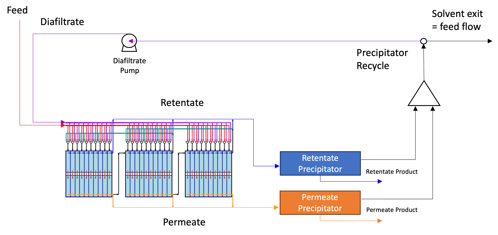

# Multi-Stage Diafiltration Flowsheet
This flowsheet provides the setup for a multi-stage diafiltration model with downstream precipitators. The model is based on the diafiltration cascades published in [literature](https://pubs.acs.org/doi/full/10.1021/acssuschemeng.2c02862) and built in IDAES.

## Model Features
- Specifiable number of membrane stages and tube elements. 
- Lumped parameter membrane model with sieving and flux parameters.
- Yield-based precipitator model using residence time to account for precipitator volume.
- Choice of superstructure configuration for different inlet degrees of freedom.
- Fixed-point iteration initialization scheme to converge recycle flows for initialization near a feasible point.

## Contents Summary
### `solute_property.py`
This is a generic property package for solutes used in the diafiltration flowsheet model that provides `flow_vol` and `flow_mass_solute` variables for mass balance equations in the model. We note that the model has been formulated so that solute mass flow rates are used (instead of concentrations). This allows for most equations to be linear.

### `membrane.py`
The `Membrane` unit model is built on top of the `MSContactor`unit model, which provides mass balances for retentate and permeate streams and `number_of_finite_elements` and `streams` arguments. The `Membrane` unit model adds required arguments of `flux` and `sieving_coefficient`, which are used in membrane transport constraints and additional side stream ports.

Mass transport across the membrane uses a lumped parameter model and is governed by a solvent flux and solute sieving equation. The solute sieving equation has been reformulated with an exponent transformation to help with numerical tractability.

### `precipitator.py`
The `Precipitator` unit model is built on top of the `Separator` unit model. This model requires an argument of `yields` for the yields of each solute and uses a residence time model to account for precipitator volume (used in costing).

### `diafiltration_flowsheet_model.py`
The diafiltration flowsheet provides a `diafiltration_model` class that initializes with all required model parameter settings. This class contains methods to build the multi-stage membrane cascade flowsheet with various superstructures and objectives, as well as an initialization scheme that sets up the model for optimization at a feasible point with appropriate degrees of freedom unfixed.

### `solve_diafiltration.py`
This is an example file for setting up and optimizing the diafiltration flowsheet with appropriate arguments. This file also provides utility for running the diafiltration flowsheet model through the command line.

### `utils.py`
This file contains methods for reporting model results.
- `report_values` prints out relevant membrane area, flow rates, recoveries, precipitator volumes.
- `visualize_flows` takes in flowsheet settings and data from report_values and visualizes the membrane cascade using matplotlib.
